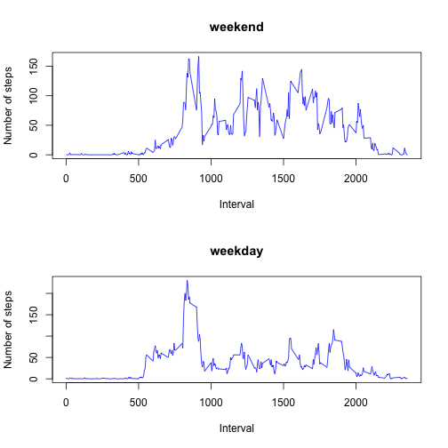

# Reproducible Research: Peer Assessment 1


## Loading and preprocessing the data

Unzipped the 'activity.zip' file and read the 'activity.csv' file into 
steps_data. Only complete cases were kept in the data frame.


```r
unzip("activity.zip")
steps_data <- read.csv("activity.csv")
head(steps_data)
```

```
##   steps       date interval
## 1    NA 2012-10-01        0
## 2    NA 2012-10-01        5
## 3    NA 2012-10-01       10
## 4    NA 2012-10-01       15
## 5    NA 2012-10-01       20
## 6    NA 2012-10-01       25
```


## What is mean total number of steps taken per day?

Below is a histogram of the total number of steps taken per day. The median and
mean is also outputted.


```r
total_daily_steps <- aggregate(steps_data$steps, list(steps_data$date), sum)
hist(total_daily_steps$x)
```

 

```r
mean(total_daily_steps$x, na.rm = TRUE)
```

```
## [1] 10766
```

```r
median(total_daily_steps$x, na.rm = TRUE)
```

```
## [1] 10765
```


## What is the average daily activity pattern?

A time series of the 5-minute interval and the average number of steps taken
across all day is shown below. The 5-minute interval with the largest average
number of steps is plotted below the plot.


```r
mean_daily_steps_pattern <- aggregate(steps_data$steps, list(steps_data$interval), 
    mean, na.rm = TRUE)
with(mean_daily_steps_pattern, plot(Group.1, x, type = "l", xlab = "Interval", 
    ylab = "Steps"))
```

 

```r
mean_daily_steps_pattern[which.max(mean_daily_steps_pattern$x), ]$Group.1
```

```
## [1] 835
```


## Inputing missing values

The number of rows with missing steps is calculated below. The new data set
will replace the missing values with the mean number of steps for the 
corresponding time interval. A histogram of the total number of steps taken per
day is plotted below as well as the mean and median. The shape of the histogram
as well as the median and mean do not seem to have changed significantly.


```r
num_missing <- sum(!complete.cases(steps_data))
steps_data <- cbind(steps_data, rep(mean_daily_steps_pattern$x, times = 61))
names(steps_data)[4] <- "mean_daily_steps_pattern"
incomplete <- !complete.cases(steps_data)
steps_data$steps <- replace(steps_data$steps, incomplete, steps_data$mean_daily_steps_pattern[incomplete])
total_daily_steps <- aggregate(steps_data$steps, list(steps_data$date), sum)
hist(total_daily_steps$x)
```

 

```r
mean(total_daily_steps$x)
```

```
## [1] 10766
```

```r
median(total_daily_steps$x)
```

```
## [1] 10766
```


## Are there differences in activity patterns between weekdays and weekends?

Below is a panel plot of 5-minute interval and average number of steps taken 
over all weekdays and weekends. 


```r
## Creates a foctor column in steps_data called 'weekdays' with two levels:
## 'weekend' and 'weekday'
days_of_week <- weekdays(as.Date(steps_data$date))
weekdays <- (days_of_week == "Saturday" | days_of_week == "Sunday")
weekdays <- factor(weekdays, c(FALSE, TRUE), c("weekday", "weekend"))
steps_data <- cbind(steps_data, weekdays)
weekend_steps_data <- steps_data[steps_data$weekday == "weekend", ]
weekday_steps_data <- steps_data[steps_data$weekday == "weekday", ]

## Creates a panel plot of 5-minute interval and average number of steps
## taken over all weekdays and weekends.
weekend_steps_pattern <- aggregate(weekend_steps_data$steps, list(weekend_steps_data$interval), 
    mean)
weekday_steps_pattern <- aggregate(weekday_steps_data$steps, list(weekday_steps_data$interval), 
    mean)
par(mfrow = c(2, 1))
plot(weekend_steps_pattern$Group.1, weekend_steps_pattern$x, type = "l", xlab = "Interval", 
    ylab = "Number of steps", col = "blue", main = "weekend")
plot(weekday_steps_pattern$Group.1, weekday_steps_pattern$x, type = "l", xlab = "Interval", 
    ylab = "Number of steps", col = "blue", main = "weekday")
```

 

